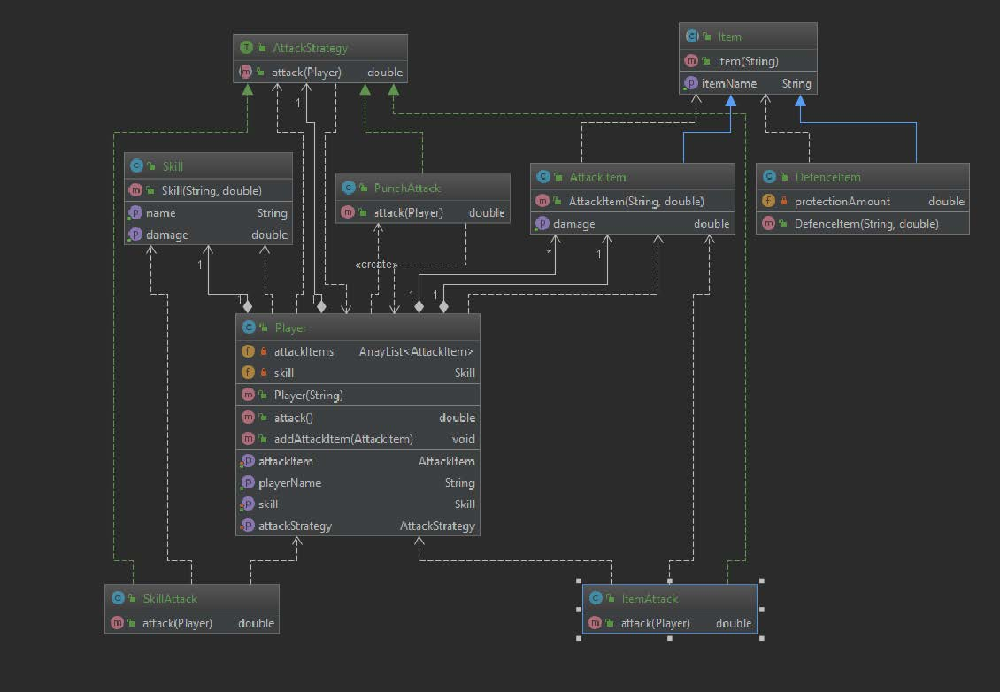

# Design Patterns
# Strategy Pattern
### Project Definition

- **Statement of Work**: 

This projects focuses to implementation of Player object for simple games,which player has ability to attack enemies. Player has different abilities or items to attack. There are different behaviors for attacking and player should handle each one properly. Player can attack with specific skill. If player attack with skill, player should have that ability otherwise it’s damage will be zero. Player can attack with attack item, and each attack item has different attack damage therefore this condition should handled for specific items.

- **Design Pattern(s)**:
I decided to use strategy pattern because Player object just want to attack with different ways(family of algorithms). It should not think about whether player has ability or attack item in its hand. It delegates to proper interface to find it’s correct implementation and use that. Also there would be different attack behaviors in the future. Therefore I should use strategy pattern for encapsulating algorithms.

- **UML**:

 - **Research**: 

 Main responsibility in the Strategy pattern is encapsulating the family of algorithm. I used strategy pattern because there is a base class Player object which has a couple of has-A relationship with Skill, AttackItem and AttackStrategy. These are the instance variables to use while attacking. In my implementation player can attack 3 different way. 
 • It can attack with a punch which is a default implementation for player. 
 • It can attack with an item. Item should set to attack item before attacking. And player must choose attack item within it’s attack items to attack enemy. If player does not have any attack item in it’s attackItems list, there will be an error message and damage will be 0. 
 • It can attack with a skill. Also skill should selected before attacking to enemy. If user does not have any proper skill for attacking, damage will be 0. I need a reference to an interface which named AttackStrategy for attacking. Because I’m delegating to attacking behavior to AttackStrategy interface to find correct implementation. I can also change its attackBehavior while program is running with setAttackBehavior() method. 
