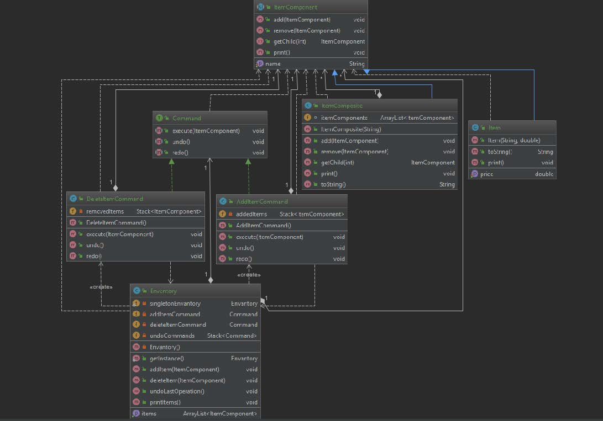

# Design Patterns
# Command,Singleton and Composite Patterns
### Project Definition

- **Statement of Work**: 

This project focuses on the implementation of Inventory System for keeping track of items added to inventory or removed from inventory. Users want to see logs and history for activities. Also, inventory can contain a different kind of groups of the object(Tree structure). Handling these kinds of add and remove operations could be tricky. User should see the object with their groups.

- **Design Pattern(s)**:

First of all, I decided to use a Singleton pattern for creating just one instance of inventory. Because if the user can create so many inventory objects in the app, we can’t control all the operations properly. Secondly, I wanted to use the Command Pattern. Because User wants to control the history and keep a log of add or remove operations. We can delegate a different kind of commands to proper command objects to handle keeping history and going back and forward in that history properly. Thirdly, I used the Composite Design Pattern. Because User wants to add/remove a group of items and normal items to inventory at the same time. Composite Pattern allows us to define a tree structure for objects and do the same operations both.

- **UML**:

 - **Research**: 

1. COMMAND PATTERN 
The main responsibility in the Command pattern is encapsulating the request. I used command pattern because Inventory requests to Command handle adding and removing operations with undo operation. These request should be handled properly and logs should be kept. Therefore it is not inventoried job. We should delegate this to Proper Commands. • AddItemCommand can add ItemComponent to inventory and support undo operation. • DeleteItemCommand can remove ItemComponent from inventory and support undo operation too. We can see Command Pattern for accessing Database and performing operations and queries in most of the open source projects.

2. SINGLETON PATTERN 
The main responsibility in the Singleton pattern is keeping only one instance object of Class. I used the singleton pattern because there should be only one instance of Inventory object. Otherwise, we can not keep control of operations on inventory. I make Inventory object’s constructor private and create a Static reference to its own class object. I create an accessing method for the singleton object. We can see Singleton Pattern in so many real-world examples. Singleton patterns are used in logging, caches, thread pools, configuration settings, device driver objects.

3. COMPOSITE PATTERN 
Compose objects into tree structures to represent part-whole hierarchies. Composite lets us treat individual objects and compositions of objects uniformly. I used the composite pattern because I am trying to add a group of the object and individual objects to inventory. And print them at the same time. The composite pattern allows me to treat the same CompositeItem and Item uniformly. I created an abstract ComponentItem base class for a group of objects and individual objects and extend this class. We need a has-A relationship to ComponentItem in the group of objects because these are a group of objects which they can hold multiple items. Both of them has a print method and we can access this method from parent reference. We can see the Composite Pattern in java.awt.Container and java.awt.ComponentApache Wicket component tree, see Component and MarkupContainer