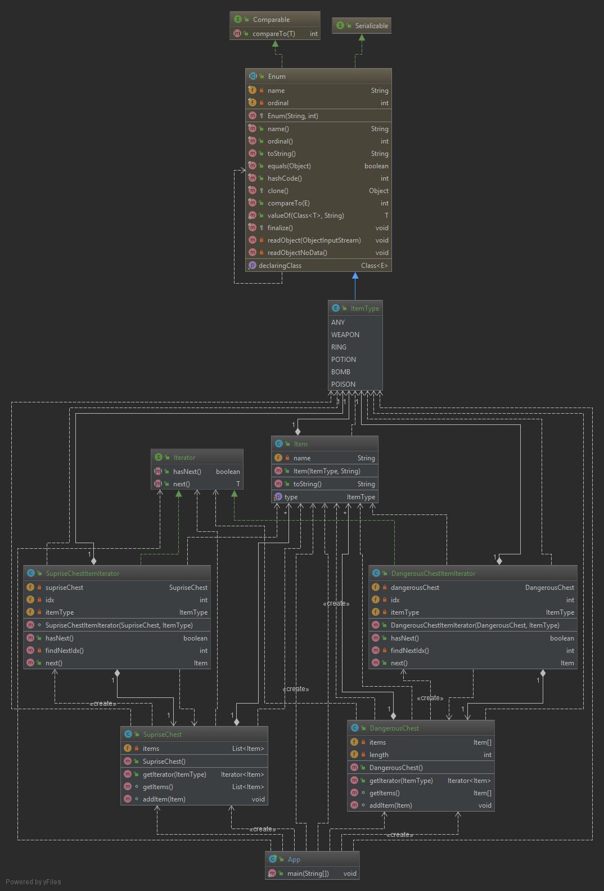

# Design Patterns
# Iterator Pattern
### Project Definition

- **Statement of Work**: 

This project focuses on the implementation of different types of chest for keeping items inside them. Player want to see different types of items chest and getting items for doing same operations. Also, chest can contain a different kind of types of the object. Handling these kinds of traversing could be tricky. User should see the types he/she want and traverse with same interface.

- **Design Pattern(s)**:

I decided to use a Iterator design pattern for traversing all the different types of Collections. Because if we can manage to get Iterator from same interface for chest, then we can easily do operations for all of them at the same time. Also I used Java Generics for creating interface for Iterator because we can easily implement new kind of Iterator.

- **UML**:

 - **Research**: 

 ## Description : 
 Provide a way to access the elements of an aggregate object sequentially without exposing its underlying representation.  

 
The main responsibility in the Iterator design pattern is encapsulating the traverse operation. I used iterator design pattern because Chest requests to Iterator interface to handle getting iterator for traverse operations. These request should be handled properly with different kind of collections of Iterators. Therefor We should delegate this operation to Iterator interface. 
Iterator interface have hasNext and getNext operations. Every class that implemented this interface must implement these methods. 
Every chest object has their specific getIterator method for their collections. We can see Iterator Design Pattern for traversing different kind of collections within the same interface.

### Real world Examples : 
* java.util.Iterator 
* java.util.Enumeration